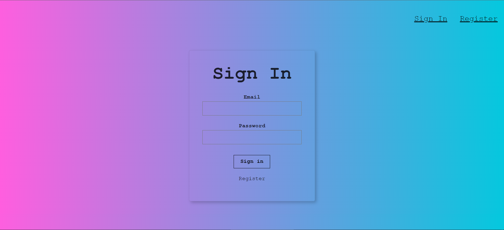
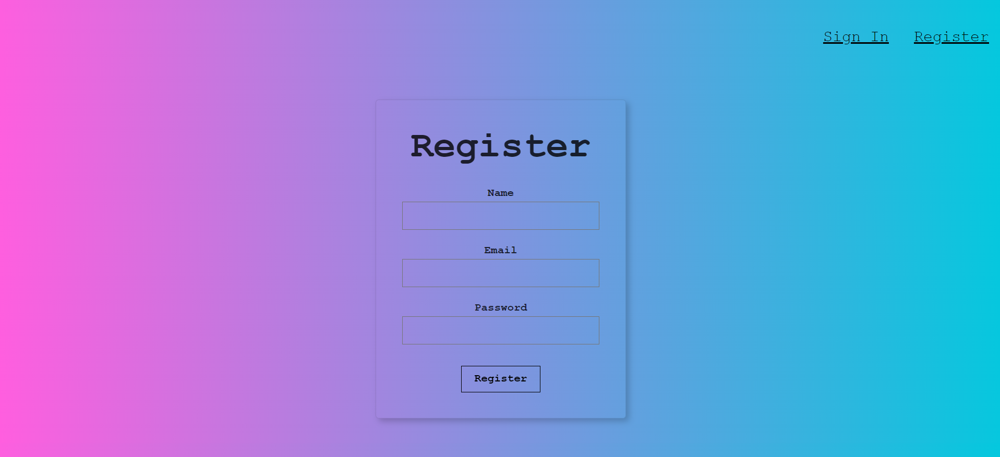
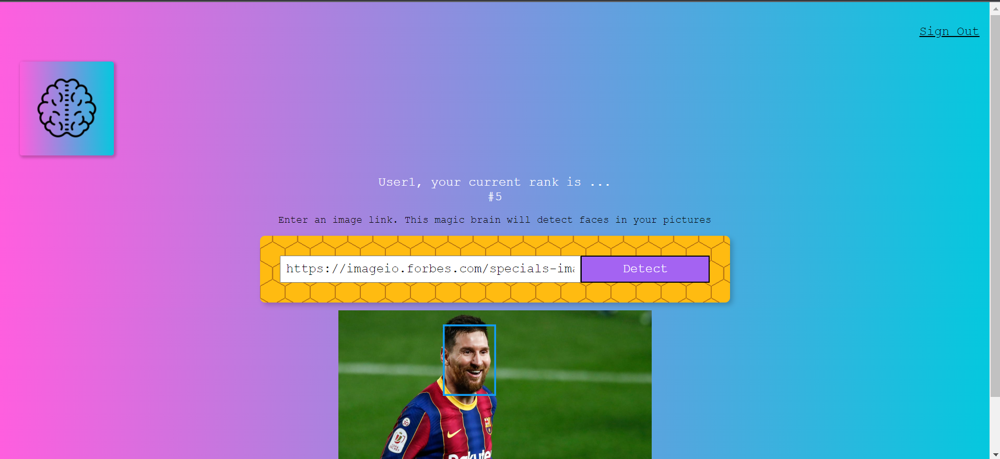

# Face Recognition Brain
This frontend app detects faces in images. It uses Clarifai API face detection model.

The backend application is [here](https://github.com/adarraji/face-recognition-brain-api).

To run the application

1. Clone this repo
2. Run `npm install`
3. Run `npm start`

## Built With

* HTML
* CSS
* Javascript
* React
* React Tilty
* Tachyons

## Deployment

Deployed on [Netlify](https://netlify.com)

You can see the website [here](https://smartbrain2.netlify.app/)

## Authors

- **Ali Darraji** - [https://github.com/adarraji](https://github.com/adarraji)

## Deploy status

## Screenshots

